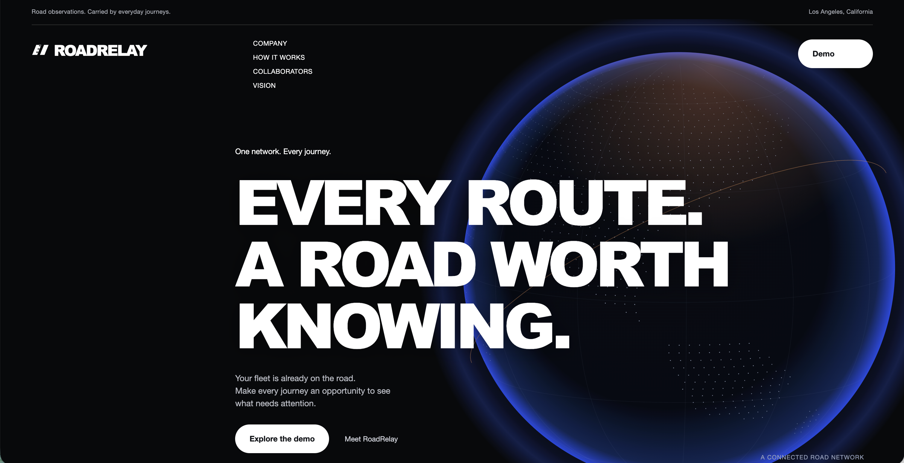
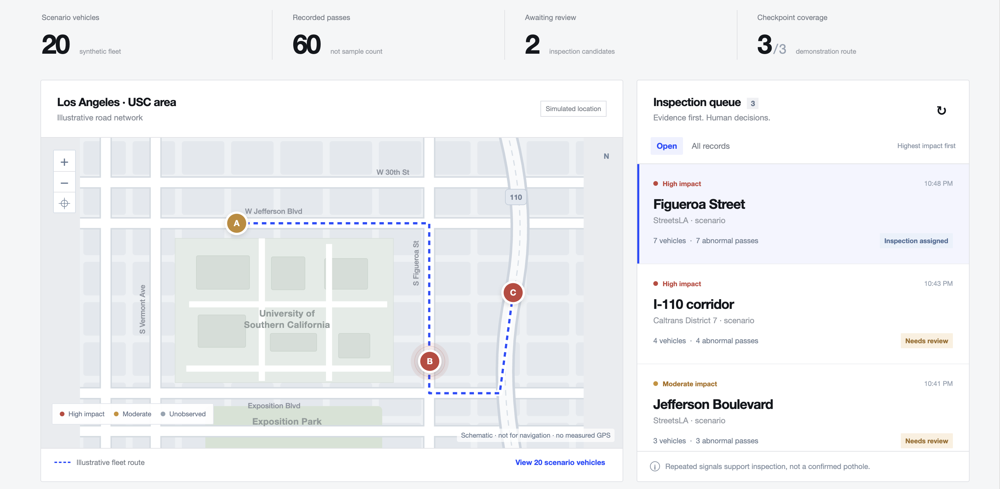
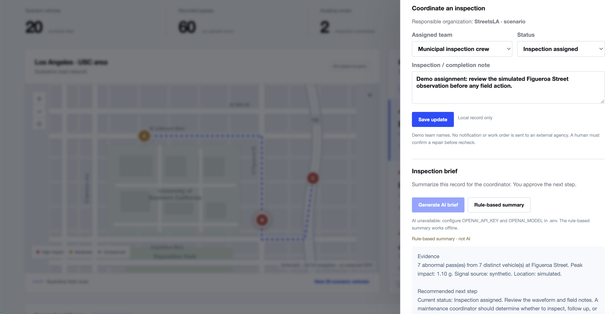
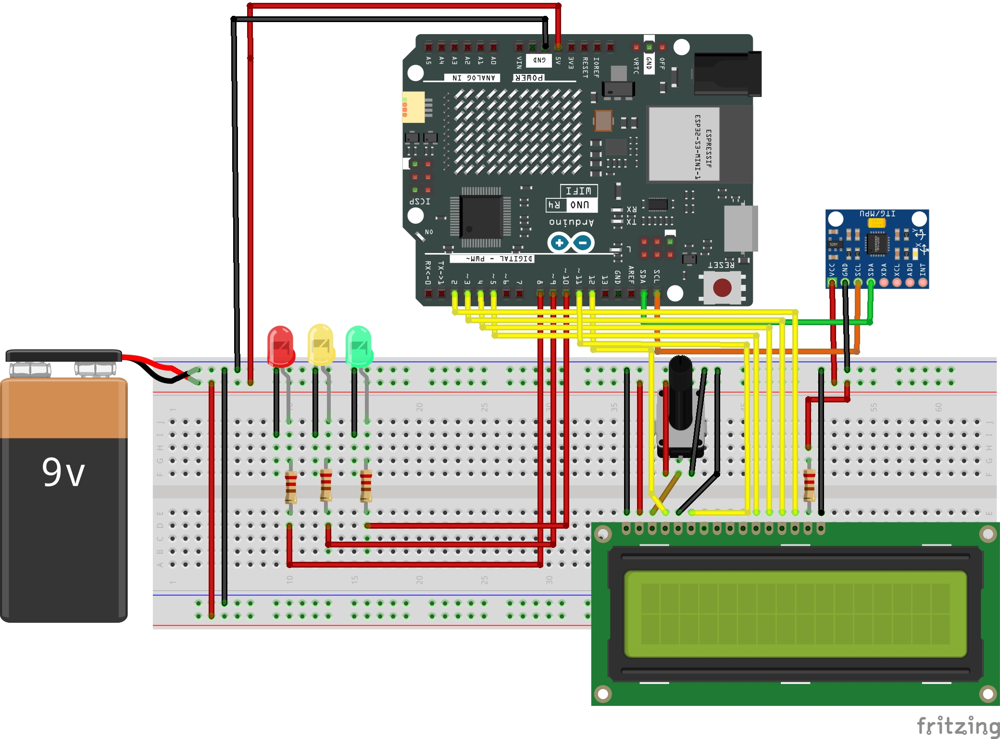
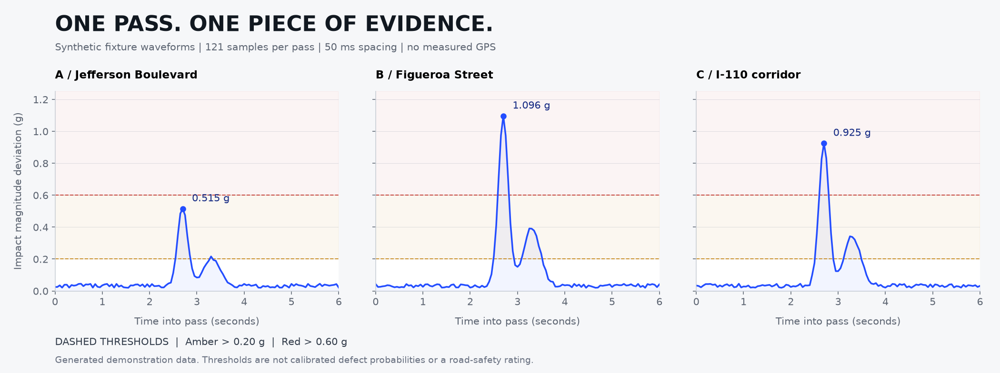
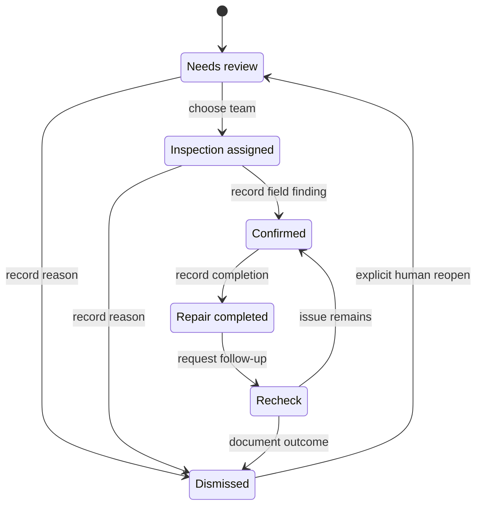

# RoadRelay

### Every route. A road worth knowing.

**Turn routine fleet journeys into evidence for the next road inspection.**

[Explore the website](https://roadrelay-rho.vercel.app/) · [Try the interactive demo](https://roadrelay-rho.vercel.app/dashboard) · [Run real hardware locally](#run-it-locally) · [Inspect the algorithm](#from-acceleration-to-an-inspection-candidate)

[](https://roadrelay-rho.vercel.app/)

*Origin Weekend 2026 · USC tiehub · Prompt D · Prototype-stage company concept*

| REAL HARDWARE | SYNTHETIC SCALE | HUMAN DECISIONS |
| :--- | :--- | :--- |
| MPU6050 + UNO R4 WiFi + LCD + LEDs | 20 vehicle IDs · 60 passes · 3 checkpoints | Review · inspect · confirm · repair · recheck |
| Toy-car impact readings sent to a local dashboard | Demonstration records, with no measured GPS | Local workflow records; no agency dispatch |

> **What this prototype proves:** sensor acquisition, local telemetry, recording, evidence aggregation, and a usable inspection workflow can operate together.
>
> **What it does not prove:** real-road detection accuracy, pothole depth, failure prediction, avoided repair costs, or customer demand. A high impact means **“suspected road anomaly, inspection needed.”**

## Navigate

[Prompt D](#prompt-d) · [Problem and evidence](#the-problem-and-the-evidence) · [Customers](#customers-and-value) · [Product tour](#product-tour) · [Architecture](#technical-architecture) · [Hardware](#hardware-and-wiring) · [Algorithms](#from-acceleration-to-an-inspection-candidate) · [Data](#the-demo-data-explained) · [Workflow](#people-and-the-maintenance-workflow) · [AI](#ai-as-an-assistant) · [Business](#business-model-hypothesis) · [Validation](#validation-and-roadmap) · [Risks](#risks-and-limitations) · [Setup](#run-it-locally) · [Submission](#origin-weekend-submission-requirements) · [Sources](#sources-and-attribution)

## Prompt D

> **How can we detect infrastructure damage and failures before they become expensive, and rapidly prioritize recovery when they occur?**

The supplied Origin Weekend prompt describes infrastructure owners spending billions on inspection, maintenance, and repair while much of the work remains manual and reactive. Utilities, telecommunications, transportation, insurance, and industrial operations face an especially difficult task after wildfires, earthquakes, floods, and storms: assessing many assets while downtime accumulates.

It invites AI, computer vision, geospatial intelligence, robotics, sensors, and other technologies to identify deterioration, anticipate failures, automate inspections, or prioritize maintenance and recovery. Its essential constraint is **everyday inspection, maintenance, or asset management first; disaster response as an additional high-value application**.

RoadRelay takes one tractable slice of that challenge: **road-surface impact observations from vehicles already doing useful work**.

| Prompt requirement | RoadRelay response | Current boundary |
| --- | --- | --- |
| Find deterioration or damage earlier | Repeated impact observations create review candidates | Impact detection is working; early deterioration detection is unvalidated |
| Reduce manual inspection burden | Give coordinators a queue with waveform evidence and repeat counts | No measured reduction in inspection hours yet |
| Prioritize maintenance and recovery | Sort candidates by measured peak; record human assignments and findings | No calibrated risk model or automatic dispatch |
| Use physical-world data | Read a real MPU6050 on a toy car | No field fleet, GPS, or real-road dataset |
| Support everyday workflows | Review, inspection, confirmation, completion, and recheck | A local workflow prototype |
| Extend to disasters | Proposed repeat passes on authorized, safe critical routes | No disaster validation or structural-damage detection |

The future disaster use case is to help an operator decide **where a qualified team should inspect next**. RoadRelay cannot certify a route as safe or detect hidden bridge, utility, or structural failures.

## The problem and the evidence

Vehicles traverse the same routes every day. Maintenance teams still need to decide which observations deserve a site visit, which organization owns the asset, and whether a reported problem was actually resolved.

A useful product must connect these decisions:

**Observe the road → preserve evidence → review a candidate → inspect → document the outcome → revisit.**

### Los Angeles context

The following figures come from published sources, not RoadRelay measurements.

| Published evidence | Value and time frame | Implication to test |
| --- | --- | --- |
| StreetsLA reduction in authorized positions | **406 positions / 26%** over the preceding two fiscal years, reported January 28, 2026 | Limited staff may benefit from better inspection selection |
| StreetsLA average pothole repair time | **5 days** in FY 2024–25; **7 days anticipated** for FY 2025–26 | Faster evidence handling may matter, but does not remove repair-capacity constraints |
| StreetsLA street network in good condition | **60%** in FY 2024–25; **53% anticipated** for FY 2025–26 | Deterioration monitoring is relevant; these are budget-report figures |
| StreetsLA resurfacing | **312 lane-miles** in FY 2024–25; **60 anticipated** for FY 2025–26 | Inspection prioritization must fit constrained maintenance capacity |

Source: [StreetsLA January 28, 2026 budget overview, pages 3 and 5][la-budget]. The future-year values were projections in that document, not subsequently verified outcomes. These numbers do not establish that RoadRelay would change them.

[StreetsLA's published workflow][la-faq] describes an initial inspection for assigned 311 requests, followed by action or referral. [USC FPM][usc-fpm] describes work orders and FAMIS as the means of managing maintenance from identification to completion. Our inference is that an evidence feed should fit those existing decisions rather than require a parallel maintenance process. No integration with either organization exists.

[Caltrans District 7][caltrans] covers Los Angeles and Ventura counties and reports **1,364 maintenance employees**, including **1,179 at 67 field offices** on its published profile. State highways and local streets have different responsible owners; proximity to USC does not make a road a USC asset.

**Research status:** desk research only. We have no first-hand interviews, signed pilots, agency endorsements, or measured willingness to pay.

## Customers and value

**First customer:** a campus or industrial-site operator that controls both a vehicle fleet and roads suitable for a scoped pilot.

**Economic buyer:** the facilities or asset-management director.

**Daily user:** the maintenance coordinator.

**Long-term market:** municipal public works and state-road operators.

Campus shuttles, maintenance vans, and service vehicles are the first deployment hypothesis. Municipal waste trucks, government service fleets, police vehicles, and postal vehicles are possible later carriers only with the relevant operator's approval. These organizations do not share one purchasing authority or one road network.

| Customer need | Proposed value | Evidence needed before claiming value |
| --- | --- | --- |
| Know where to inspect next | Prioritized, reviewable observations | More confirmed findings per inspection hour |
| Revisit routes without dedicated survey trips | Use journeys already being made | Usable coverage, installation reliability, and incremental operating cost |
| Understand repeated reports | Count passes and distinct devices separately | Lower false-alarm burden after calibration |
| Track the next action | Assignment, findings, completion, and recheck history | Coordinator adoption and fit with existing work orders |
| Verify follow-up | Compare subsequent observations with field findings | Comparable speeds, vehicles, positions, and inspection labels |

**Mission:** Make routine journeys useful to the people who maintain our roads.

**Vision:** A road network where emerging problems reach the right team before disruption grows.

## Product tour

### 1. See the network and review the queue



The screenshot shows **synthetic** observations at Jefferson Boulevard, Figueroa Street, and an I-110 corridor marker. It does not report actual road defects. The map is an offline schematic, not a navigation or GIS map.

The screenshot has **3 open records but 2 awaiting review**: one record has already been assigned. “Awaiting review” counts `Needs review` and `Recheck`; it is not the total number of open records.

### 2. Coordinate the next inspection



A coordinator can assign a demonstration team, update the record, and add findings. The pictured summary is **rule-based, not AI**. Assignment changes do not message StreetsLA, Caltrans, USC, or a contractor.

### 3. Run the real toy-car demonstration

1. Open the **local** application and select **Live prototype**.
2. Wait for fresh readings from the intended device.
3. Select demo location A, B, or C and press **Start recording**.
4. Roll the toy car across a controlled test surface.
5. Show the LED response and real impact waveform together.
6. Press **Finish recording**, then review the candidate.
7. Repeat the pass to demonstrate aggregation.
8. Use the separate **Fleet simulation** workspace to explain multi-vehicle scale.

A normal pass contributes to coverage but creates no candidate. Pausing or replaying the chart does not stop local data collection.

## Technical architecture

### Two deliberately separate environments

```mermaid
flowchart TB
  subgraph LOCAL["Local hardware application"]
    S["MPU6050<br/>3-axis acceleration"] -->|I2C| A["UNO R4 WiFi<br/>impact + LED state"]
    A --> H["LCD + green / yellow / red LEDs"]
    A -->|"12-sample UDP batches :4210"| R["Python receiver<br/>token + schema + sequence checks"]
    A -->|"USB serial 115200 baud"| B["Optional serial bridge<br/>host-timed fallback"]
    B -->|"Local HTTP telemetry"| R
    R --> DB[("SQLite<br/>samples / passes / incidents / audit")]
    DB --> API["Loopback HTTP API<br/>127.0.0.1:8765"]
    API --> UI["Browser dashboard<br/>live evidence + local workflow"]
    UI -->|"Explicit brief request"| AI["Optional server-side AI call"]
  end
  subgraph PUBLIC["Public Vercel website"]
    BUILD["Allowlisted static build"] --> SITE["Company homepage"]
    BUILD --> DEMO["Synthetic dashboard"]
    FIXTURE["demo-data.json<br/>fresh synthetic fixture"] --> DEMO
    DEMO --> LS[("Browser localStorage<br/>scenario edits")]
  end
```



There is **no telemetry connection from the Arduino to Vercel**. The public site's “Local prototype” action opens the separately running application on the visitor's own computer. It does not expose the developer's computer.

| Layer | Implementation | Responsibility |
| --- | --- | --- |
| Sensing and device output | Arduino C++, Wire, LiquidCrystal, WiFiS3 | Read acceleration; calculate impact; maintain LEDs/LCD; transmit batches |
| Local ingestion | Python standard library, UDP socket, HTTP handler | Validate packets, reject duplicates, count sequence gaps |
| Persistence | SQLite with WAL; serialized access using an `RLock` | Samples, passes, incidents, evidence links, audit entries |
| Local application | ThreadingHTTPServer bound to loopback | JSON API, static files, CSV export, optional brief generation |
| Frontend | Plain HTML/CSS/JavaScript | Poll state every 600 ms, draw waveforms, review and update observations |
| Public simulation | Static JSON + browser adapter + localStorage | Demonstrate workflow without a hardware receiver or shared database |
| Website | Local Canvas globe, SVG vehicle illustration, responsive CSS | Explain the company and link to the demo |
| Build/deploy | Node build script + Vercel static output | Copy only allowlisted public assets into `public/` |

The public homepage supports reduced motion and pauses globe animation when hidden or offscreen. Mobile globe drawing is capped at approximately 30 frames per second; this is a rendering target, not a hardware sensing rate.

### Data model

| Entity | Key fields | Meaning |
| --- | --- | --- |
| `samples` | mode, device, received, measured, impact, level, pass_id, transport | A measurement; may have no pass/location |
| `passes` | mode, checkpoint, device, started, ended, peak, sample_count | One explicitly recorded traversal |
| `incidents` | mode, checkpoint, peak, status, assignee, note, brief | A review candidate, not a verified pothole |
| `evidence` | incident_id, unique pass_id | Prevents one pass from inflating evidence counts |
| `audit` | incident_id, time, message | Local record of findings and state changes |
| `meta` | key, value | Tracks initialization of the synthetic scenario |

Live device presence and sequence tracking are held in memory. Restarting the server ends unfinished passes; it does not silently resume a physical recording. Historical data persists in SQLite.

### Local API

| Method | Route | Purpose |
| --- | --- | --- |
| GET | `/api/state?mode=live` or `simulation` | Samples, candidates, devices, counters, active pass |
| GET | `/api/setup` | Local receiver configuration; contains a private token |
| GET | `/api/incidents/{id}` | Evidence, allowed next states, notes, and history |
| POST | `/api/passes/start`, `/api/passes/stop` | Begin/end one manually tagged traversal |
| POST | `/api/telemetry` | Token-checked HTTP input used by the USB bridge |
| POST | `/api/incidents/{id}` | Validate and save a workflow update |
| POST | `/api/incidents/{id}/brief` | Explicit AI or rule-based brief request |
| GET | `/api/export?mode=live` or `simulation` | Export selected local workspace samples |

Only one live pass can be active at a time in this MVP. Receiving packets from multiple devices is not equivalent to supporting concurrent field-fleet recording. The hosted adapter imitates selected API operations in the browser; Vercel does not run these Python routes.

## Hardware and wiring

The prototype uses an **UNO R4 WiFi, MPU6050 breakout, 16×2 parallel LCD, three LEDs with current-limiting resistors, a contrast potentiometer, and a toy car**.

> **Power correction for the supplied illustration:** the 9 V battery appears connected to the same rail as the board's 5 V pin. **Do not reproduce that power connection.** Use USB-C power for the bench demo. An external 9 V supply belongs at the appropriate barrel jack or VIN input with correct polarity, never directly on the 5 V rail. Verify breakout voltage compatibility and current limits against the exact components. The board's documented VIN range is 6–24 V. [Arduino hardware specification][arduino]



*User-supplied Fritzing-style reference image. The original is preserved; the warning above and the firmware pin table below take precedence as documentation. The physical assembly has not been electrically certified.*

| Connection | Current firmware mapping |
| --- | --- |
| MPU6050 SDA / SCL | Board SDA / SCL, via `Wire`; I2C address `0x68` |
| LCD RS / Enable | D12 / D11 |
| LCD D4 / D5 / D6 / D7 | D5 / D4 / D3 / D2 |
| Green / yellow / red LED | D8 / D9 / D10, respectively |
| Serial output | 115200 baud |
| Shared reference | Common ground; check the breakout's supply and I2C voltage requirements |

The sensor is a six-axis IMU, but this sketch reads **only its three accelerometer axes**. It does not implement gyroscope fusion. Deployment under a real vehicle would require mounting, weather, vibration, power, and electrical protection beyond this breadboard prototype.

## From acceleration to an inspection candidate

The current detector is a transparent threshold pipeline. It is not a trained pothole classifier.

### 1. Acquire and scale acceleration

The sketch wakes the MPU6050 using register `0x6B = 0x00`, sets `ACCEL_CONFIG 0x1C = 0x10` for the ±8 g range, and sets `CONFIG 0x1A = 0x03` for its digital low-pass filter setting. Six bytes beginning at `0x3B` are read as signed 16-bit X, Y, and Z acceleration.

The implemented conversion is:

```math
a_x = r_x / 4096, \qquad a_y = r_y / 4096, \qquad a_z = r_z / 4096
```

Here `r` is a raw count and `a` is in g. See the [actual firmware](firmware/RoadRelayWiFi/RoadRelayWiFi.ino) for the exact register writes and processing order.

### 2. Calculate impact

```math
I_t = \left|\sqrt{a_{x,t}^{2}+a_{y,t}^{2}+a_{z,t}^{2}}-1\right|
```

This is the deviation of the acceleration **magnitude** from 1 g. It is not isolated vertical acceleration, a full gravity-vector subtraction, road roughness in IRI units, or pothole depth. It reduces dependence on static sensor orientation, but acceleration from braking, turning, mounting motion, and suspension can still affect it.

| Illustrative magnitude | Calculated impact | Instantaneous class |
| ---: | ---: | --- |
| 1.04 g | 0.04 g | Below threshold |
| 1.35 g | 0.35 g | Moderate |
| 1.82 g | 0.82 g | High |

These examples are arithmetic, not test results.

### 3. Apply strict thresholds and preserve LED visibility

```math
c_t =
\begin{cases}
2 & I_t > 0.60 \\
1 & 0.20 < I_t \leq 0.60 \\
0 & I_t \leq 0.20
\end{cases}
```

- **Green:** this observation did not exceed the demonstration threshold; it is not a road-safety certificate.
- **Yellow:** moderate impact, requiring context and repeat observations.
- **Red:** high impact; suspected road anomaly, inspection needed.

The thresholds are uncalibrated demonstration settings. Exactly 0.20 g remains below threshold; exactly 0.60 g remains moderate.

The displayed LED level retains the highest qualifying state until more than **1,500 ms** have elapsed since the last impact at or above that held level. A lower impact cannot immediately replace a held red state. Consequently, a low current impact can coexist with a red LED. Candidate generation uses impact measurements, not the LED hold.

The LCD retains the original `POTHOLE!` wording; the product interpretation remains **suspected anomaly**. Its 1–10 severity display is a clipped linear mapping of held peak impact using a 1.5 g scale, not a standardized pavement score.

### 4. Display tilt separately

```math
\theta_t = \operatorname{atan2}\!\left(\sqrt{a_x^2+a_y^2}, |a_z|\right) \frac{180}{\pi}
\qquad
\bar\theta_t = 0.9\bar\theta_{t-1}+0.1\theta_t
```

This smoothed, unsigned tilt estimate is an LCD aid. It is not used to confirm road defects or transmitted as a telemetry field. Dynamic acceleration makes it an unreliable substitute for a calibrated road-slope measurement.

### 5. Batch, validate, and timestamp

An illustrative payload, with fictitious credentials and values:

```json
{
  "token": "YOUR_PRIVATE_LOCAL_TOKEN",
  "device": "RR-01",
  "boot": "123456",
  "seq": 42,
  "samples": [
    [12000, 0.041, 0],
    [12012, 0.812, 2]
  ]
}
```

The shortened example shows the schema; normal WiFi firmware batches contain **12 samples**. Each sample is `[device_milliseconds, impact_g, held_LED_level]`. The Arduino uses local UDP port 4211 and sends to the computer's port 4210.

The receiver validates device IDs, finite numeric values, time ordering, impact range 0–20 g, and LED levels 0/1/2. The 20 g input bound is schema validation, not a claim about calibrated sensor range.

For each `(device, boot, transport)` session:

```text
if seq <= previous_seq:
    ignore duplicate or out-of-order packet
else:
    missing_batches += max(0, seq - previous_seq - 1)
    accept validated samples
```

It estimates the host-aligned sample time within a batch as:

```math
\hat t_i = t_{\mathrm{arrival}} - \frac{m_{\mathrm{last}}-m_i}{1000}
```

This preserves device-relative timing within the batch. It is not clock synchronization and includes network/buffering uncertainty. The USB fallback timestamps host arrival and reconstructs the LED hold.

There is a **10 ms delay per loop**, plus I2C, serial, display, and network work. Therefore **100 Hz is not a measured or guaranteed acquisition rate**. The 600 ms browser poll interval is also not an end-to-end latency guarantee.

### 6. Convert samples into passes, then candidates

```text
receive valid batch
    save samples, including samples outside a recording
    if active_pass belongs to this device:
        associate samples with that pass
        update pass peak and sample count
        if batch peak > 0.20 g:
            reuse the pass's existing evidence link, if any
            otherwise attach the pass to an open candidate at this checkpoint
            otherwise create a new candidate
```

For a candidate, the displayed evidence includes:

```math
P = \max(I_i), \qquad
A = \#\{\text{linked abnormal passes}\}, \qquad
V = \#\{\text{distinct device IDs in those passes}\}
```

**Forty above-threshold samples from one pass still mean one abnormal pass.** Three abnormal passes from RR-01 count as three passes and one distinct device. Distinct IDs are not verified physical identities; production needs device enrollment and authentication.

Candidates currently aggregate by manually selected checkpoint, not geographic distance. A new abnormal pass can create a new candidate after a previous record is dismissed or marked repaired. Existing evidence does not disappear.

The local queue places nonclosed records first, then sorts by descending peak impact. Repeated passes are visible evidence; they do not currently affect a learned probability or weighted priority score. The hosted fixture begins in the same peak order and retains its fixture order as statuses change.

### GPS and scoring roadmap — not implemented

A future field system would collect GNSS, speed, vehicle/mount information, and authorized route context, then group nearby observations by road segment, direction, time, and location uncertainty. Clustering by coordinates alone can merge opposite lanes or overpasses incorrectly.

A proposed research pipeline is:

```text
calibrated IMU + GNSS + speed
    → speed/vehicle normalization
    → event windows and features
    → road-segment matching
    → distinct-vehicle corroboration
    → operator-reviewed inspection priority
    → field labels and repair follow-up
```

Candidate features to evaluate include peak impact, duration above threshold, window RMS, and speed. Feature windows and thresholds must be chosen using labeled field data. A future score could combine normalized impact, corroboration, asset criticality, and recency, but **no weights, calibrated score, or failure predictor exist in this release**.

## The demo data explained



*Generated directly from the checked-in fixture by [this optional plotting script](docs/generate_signal_figure.py), not from hardware recordings. Each panel is one pass, not an average across a fleet.*

The [seed generator](server.py) uses `random.Random(26)`. It creates 20 vehicle IDs at each of three checkpoints, for **60 passes**. Every pass contains **121 samples at 50 ms spacing**, spanning six seconds: **7,260 samples in the full seeded local scenario**.

The seed's waveform is generated, not recorded:

```math
I_j = 0.02 + U(0,0.025)
+ A\exp\!\left[-\left(\frac{j-54}{3}\right)^2\right]
+ 0.35A\exp\!\left[-\left(\frac{j-66}{5}\right)^2\right]
```

The generator uses a low amplitude for ordinary passes and larger checkpoint-specific amplitudes for a chosen number of abnormal passes. Its LED field follows instantaneous thresholds rather than simulating the physical 1.5-second hold.

| Synthetic checkpoint | All passes | Abnormal passes | Distinct abnormal vehicle IDs | Peak in checked-in fixture | Abnormal/all passes |
| --- | ---: | ---: | ---: | ---: | ---: |
| A · Jefferson Boulevard | 20 | 3 | 3 | 0.515 g | 15% |
| B · Figueroa Street | 20 | 7 | 7 | 1.096 g | 35% |
| C · I-110 corridor | 20 | 4 | 4 | 0.925 g | 20% |
| Total | 60 | 14 | 7 across the overlapping abnormal ID sets | — | 23.3% |

The **20-vehicle fleet** includes normal passes. The abnormal device sets overlap across locations; adding 3 + 7 + 4 does not produce 14 distinct vehicles.

These ratios describe a deliberately constructed fixture. They are **not precision, recall, defect probability, or an estimate of real LA road conditions**. The current total-pass denominator spans recorded passes at the checkpoint, so it is not a matched time-window risk estimate.

The hosted JSON contains the strongest pass waveform for each of the three candidates: **363 evidence samples**, plus summary records. Its CSV exports those evidence samples, not all 7,260 seeded samples. Local CSV export includes all stored samples in the selected workspace, with device time, pass, checkpoint, transport, and source labels.

### Capability status

| Capability | Status | Evidence or limit |
| --- | --- | --- |
| Toy-car impact acquisition, LEDs, LCD | Implemented | Physical prototype; no real-road accuracy study |
| WiFi ingestion and USB fallback | Implemented locally | Connection depends on LAN conditions; startup reconnect is limited |
| Recording, waveform replay, CSV | Implemented locally | One active pass at a time |
| Inspection assignment and history | Implemented | Local records; no real dispatch |
| Public website and mobile layout | Implemented | Homepage and hosted scenario |
| 20 vehicles / 60 passes | Synthetic | Generated scenario only |
| A/B/C positions and map | Simulated | Operator selection and illustrative coordinates |
| Model-generated inspection brief | Optional integration | Requires local credentials and model configuration; disabled in hosted demo |
| Rule-based summary | Implemented | Explicitly labeled “not AI” |
| Real GNSS, speed normalization, GIS | Planned | No working field implementation |
| Multi-user access, agency work orders, notifications | Planned | No production platform or connected agency |
| Detection accuracy, savings, failure prediction | Unverified | No valid field metrics yet |
| Customers and partnerships | Unvalidated | No paid customers or signed partners claimed |

## People and the maintenance workflow

| Role | Responsibility | What RoadRelay provides today |
| --- | --- | --- |
| Fleet operator | Approve installation, vehicle access, routes, and safe operation | A proposed operating model |
| Driver | Continue normal duties; report device issues when safe | A passive-sensing concept; toy-car operator starts passes manually |
| Maintenance coordinator | Review evidence, check ownership, assign an inspection | Queue, waveform, repeat counts, demo assignment, notes |
| Asset owner / public works | Approve priorities, budgets, and repair authority | A reviewable local record, not procurement authorization |
| Inspector | Visit the site and record the actual cause and condition | Confirmation/dismissal and required findings |
| Contractor / maintenance crew | Carry out authorized work and document completion | Completion notes in the demo workflow |
| Coordinator and inspector | Revisit and decide whether the issue remains | Recheck state and subsequent evidence |

The local state machine is:



Assignment requires a team. Transitions into Confirmed, Dismissed, or Repair completed require a note. The hosted adapter also permits Confirmed → Dismissed; that extra transition is not present in the local backend.

**Future dispatch policy:** verify jurisdiction first, distinguish inspection from repair, obtain the asset owner's authorization, and let authorized crews choose the work plan. RoadRelay currently provides no crew scheduling, route optimization, SLA engine, external notification, or procurement integration.

## AI as an assistant

The optional local AI feature receives an event summary and inspection note only after the user clicks **Generate AI brief**. It drafts **Evidence, Recommended next step, and Unknowns**. The integration is server-side; credentials are not placed in browser JavaScript.

The current implementation asks for a short English brief, marks location as simulated, distinguishes live toy-car readings from synthetic data, and prohibits unsupported depth, probability, cost, GPS, or dispatch claims. The model cannot change assignments, priorities, or state. If key evidence fields change before a result returns, that result is rejected as stale.

Without configuration, or on the public site, use **Rule-based summary**. It is an offline template and explicitly not AI. AI output still requires human review. The API request uses `store: false`; that setting is not a promise of zero provider retention.

## Business model hypothesis

### Campus first, public infrastructure over time

The first pilot should have one accountable operator, a bounded road network, and a small fleet. Municipal procurement becomes more credible after real-world precision, usable coverage, installation cost, and coordinator value are measured.

Government-only branding is not a technical moat. Competing successfully requires evidence that a specific customer can obtain useful, affordable inspection decisions through RoadRelay.

### Who pays, how, and why

| Item | Starting hypothesis | What remains to validate |
| --- | --- | --- |
| Buyer | Campus/site facilities or asset owner; later public works | Budget owner, approval process, and urgency |
| Software | **$300 per site per month**, initially up to 10 vehicles | Willingness to pay, cost to serve, appropriate usage limits |
| Setup | **$250 per installed device** | Hardware, enclosure, labor, support, and replacement costs |
| Value | Better inspection selection and traceable follow-up | Measured useful findings and coordinator effort |
| Expansion | Additional sites, vehicles, and work-order integration | Demand, scope, delivery cost, and procurement |

These are unvalidated pricing hypotheses, not an offer, customer quote, or gross-margin claim.

At 100 paying sites, the subscription arithmetic is:

```text
100 sites × $300/month × 12 months = $360,000 annual recurring software revenue
```

That is a scenario before churn, discounts, costs, taxes, and support—not a forecast. Setup revenue is nonrecurring.

A pilot should measure **net operating benefit** as observed labor/process savings minus subscription, annualized setup, support, and the cost of false inspections. Avoided future repair or accident costs should remain outside the calculation until there is defensible evidence.

### First 100 paying organizations

| Stage | Target | Acquisition work | Gate before expansion |
| --- | ---: | --- | --- |
| Founder-led design partners | 5 | Direct facilities outreach and bounded pilot offers | Installation permission, inspection labels, and useful workflow feedback |
| References and campus/site networks | 20 more | Case studies, operator referrals, qualified facilities associations | Reproducible value and a paid conversion |
| Maintenance/inspection channels | 75 more | Train service partners who already support relevant sites | Partner economics, repeatable onboarding, and support capacity |

The total is 100 organizations, not 100 devices. These are targets, with no signed channel partnerships. Track qualified accounts → discovery calls → approved pilots → paid conversions → renewals; conversion assumptions are still unknown.

California's **116 community colleges** provide a published list from which to screen prospects, not 116 automatically qualified buyers. Some campuses lack suitable roads/fleets and districts may consolidate purchasing. This is not a quantified TAM. [Chancellor's Office][ccc]

### Alternatives and differentiation

| Alternative | Published approach | RoadRelay's positioning hypothesis |
| --- | --- | --- |
| Manual surveys / 311 reports | People identify, inspect, and refer issues | Add evidence from routine passes while retaining inspection authority |
| NIRA Road Health | Connected-vehicle road-condition data and maintenance analysis | Test a retrofit prototype with one bounded-site operator |
| Bentley Blyncsy | AI analysis of crowdsourced dashcam imagery for road assets and defects | Explore IMU evidence where an impact signal is useful; accept loss of visual context |
| Existing asset/work-order platforms | Manage approved maintenance and completion records | Ultimately feed reviewed evidence into them; no integration exists yet |

Sources: [NIRA][nira], [Bentley][blyncsy], [StreetsLA][la-faq], [USC FPM][usc-fpm]. No comparative accuracy, cost advantage, exclusivity, or “first of its kind” claim is made. A potential future advantage is calibrated data linked to verified maintenance outcomes; that dataset does not yet exist at scale.

## Validation and roadmap

### Proposed six-week pilot

| Period | Work | Deliverable |
| --- | --- | --- |
| Weeks 1–2 | Interview drivers, coordinators, inspectors, and buyer; agree authorized routes and labeling | Pilot protocol, baseline workflow, and acceptance criteria |
| Weeks 3–4 | Instrument three vehicles; add position/speed; repeat controlled routes with independent inspections | Labeled pass-level dataset across vehicles and speeds |
| Weeks 5–6 | Run coordinator review; compare with baseline; assess paid offer and support cost | Evidence on detection utility, workflow value, and unit economics |

### Metrics to report

| Question | Metric |
| --- | --- |
| How often is a candidate useful? | Precision = TP / (TP + FP), using independently inspected candidates |
| What did the system miss? | Recall = TP / (TP + FN), requiring inspection of unflagged segments too |
| How much extra work does it create? | False candidates per 100 vehicle-km and per inspection hour |
| Can a crew find the location? | Median and 95th-percentile location error against verified reference positions |
| Is the pipeline usable? | End-to-end latency, connection availability, and observed sequence gaps |
| Does coordination improve? | Confirmed findings per inspection hour; time to human assignment |
| Does a buyer value it? | Paid pilot conversion, renewal, and support cost per site |

Define TP/FP/FN at the defect or road-segment level, not at the raw-sample level. Split evaluation by road segment, vehicle, and day to reduce leakage from repeated passes. Report sample sizes and uncertainty. A labeled test set is needed before adding a learning-based classifier or claiming prediction.

**No values for these metrics have been established.** Software tests validate implementation behavior, not road-damage accuracy.

## Risks and limitations

| Category | Risk | Current limit / next mitigation |
| --- | --- | --- |
| Sensing | Bumps, joints, braking, suspension, and mounting resemble defects | Review cues only; collect labeled controls and calibrate by vehicle/speed |
| Sampling | Variable loop time, sensor saturation, filtering, and batch delay affect events | Preserve timing; measure acquisition and latency under actual loads |
| Location | Manual checkpoints do not identify lanes or actual road positions | Add GNSS and uncertainty-aware segment matching |
| Coverage | Frequently traveled routes dominate; silence can hide gaps | Report unobserved routes separately; no “safe road” inference from missing data |
| Connectivity | Startup WiFi attempt can fail; UDP drops packets | Reset/reconnect for demo, inspect sequence gaps, retain USB fallback |
| Scale | One active pass, in-memory device state, growing SQLite samples | Add concurrent pass management, retention, monitoring, and device provisioning |
| Dispatch | Incorrect ownership or unreliable evidence wastes inspection effort | Human review; validate jurisdiction and connect approved work-order systems |
| Privacy/security | Production location trails can reveal operations; local UDP is not encrypted | Access controls, encryption, retention, and fleet consent are production work |
| Hardware | Exposed breadboard and incorrect power wiring can damage equipment | Correct the illustrated power issue; use a protected, reviewed enclosure and supply |
| Commercial | Procurement, installation, support, competition, and low willingness to pay | Scoped pilots, measured costs, paid conversion, and renewals |
| Disaster use | No evidence of structural damage or safe-route detection | Keep disaster recovery as a future inspection-support use case |

**Prototype security:** HTTP is restricted to loopback and checks Host/Origin; UDP accepts a shared local token. This is not a production authentication system. Never port-forward it. The public build allowlists static files and synthetic data.

**Repository history:** an earlier commit included local credentials and data. They were removed from the current tree; removal does not erase history. Rotate any exposed WiFi credentials and receiver token before relying on them. Do not reuse historical values.

## Run it locally

### Requirements

- Python **3.9+**, standard library only, for the local application.
- Node **22+** for the static build and JavaScript tests.
- Arduino IDE with the **UNO R4 board package**, plus **LiquidCrystal by Arduino** for the hardware sketch.
- A trusted 2.4 GHz network that permits peer-to-peer communication, or the USB fallback.

### Start the local dashboard

```sh
git clone https://github.com/Boxxelf/RoadRelay.git
cd RoadRelay
python3 server.py
```

Open **http://127.0.0.1:8765/** and select **Demo**, or open **http://127.0.0.1:8765/dashboard**. Keep the process running. The dashboard's charts and schematic require no internet, external fonts, or map API.

### Connect the UNO R4 WiFi

1. Copy `firmware/RoadRelayWiFi/arduino_secrets.example.h` to `arduino_secrets.h` in the same directory.
2. Enter the network name/password, the computer's current LAN IPv4 address, and the token from the local **Connect device** panel. Keep `DEVICE_ID` consistent with the dashboard.
3. Open `firmware/RoadRelayWiFi/RoadRelayWiFi.ino`, choose **Arduino UNO R4 WiFi**, and upload.
4. Wait for fresh sensor data, then start a pass.

`RECEIVER_IP` is the **computer's address**, not the router address, `127.0.0.1`, or the Vercel domain. On a Mac, check Wi-Fi → Details → TCP/IP, or `ipconfig getifaddr en0` if WiFi uses en0. Addresses may change when networks change.

The firmware initiates WiFi once during startup and then waits up to eight seconds after `WiFi.begin` returns. It does not keep reissuing connection attempts. Reset the board after a failed startup or network change. For iPhone hotspots, enable **Allow Others to Join** and **Maximize Compatibility**, then keep the hotspot settings screen open while connecting. [Apple guidance][apple-hotspot]

A hotspot's connected-device count alone cannot prove that this particular board joined or that UDP delivery works. If the dashboard remains offline, check SSID/password, upload the changed settings, verify the receiver IP/token, and use USB if needed.

### USB fallback

The included WiFi sketch retains the serial stream expected by the bridge; the original sensor sketch is not required to be separately bundled here. Close Arduino Serial Monitor and Serial Plotter so the bridge has exclusive access.

```sh
ls /dev/cu.*
python3 serial_bridge.py --port /dev/cu.usbmodemYOUR_PORT
```

Use the actual port name. The bridge uses POSIX `termios` and supports macOS/Linux, not Windows. Do not simultaneously ingest WiFi and USB for the same device. For a USB-only run with the included sketch, leave its placeholder SSID unchanged so it does not establish WiFi.

This redraws the `Impact:` values in the dashboard; it does not embed or import the Arduino IDE plot image. USB timestamps and LED states are reconstructed estimates.

### Optional local AI

Copy `.env.example` to `.env`, configure `OPENAI_API_KEY` and `OPENAI_MODEL`, and restart the server. Click **Generate AI brief** only when you intend to send that selected record to the provider. Keep credentials out of screenshots, commits, and presentations.

### Build the public site

```sh
npm run build
```

The build produces `public/` for Vercel, including the homepage and `/dashboard` synthetic demo. It does not publish the local SQLite store, receiver token, firmware secrets, Python server, or README media. No npm package installation is required for this build.

Regenerate the synthetic fixture only when intentionally updating it:

```sh
python3 scripts/export-demo.py
```

That script uses an isolated temporary database, not hardware recordings. Public workflow edits stay in that browser's localStorage and are not shared between visitors.

### Verify implementation

```sh
PYTHONDONTWRITEBYTECODE=1 python3 -m unittest discover -s tests -v
python3 tests/integration.py
npm run test:web
npm run build
```

The receiver tests cover source isolation, pass aggregation, duplicate/old packets, invalid input, workflow validation, persistence, and post-repair evidence. The integration script uses temporary storage and ports **18765 / 14210**, not the primary demo data. Frontend tests cover the hosted scenario and globe lifecycle. They do not establish field accuracy.

### Repository guide

```text
firmware/RoadRelayWiFi/    Sensor logic and WiFi transport
server.py                Local HTTP API, UDP ingestion, SQLite, optional AI
serial_bridge.py         USB-to-local-HTTP fallback
dist/                    Source HTML, CSS, JavaScript, and synthetic fixture
scripts/build-web.mjs     Allowlisted static build
scripts/export-demo.py    Isolated synthetic fixture generation
tests/                   Receiver, integration, hosted-demo, and motion checks
docs/images/             README screenshots and supplied hardware reference
data/                    Private runtime records and token; ignored by Git
public/                  Generated website output; ignored by Git
```

## Origin Weekend submission requirements

Based on the organizer documents supplied to the team: **F26 Origin Weekend Prompts**, **Judging Criteria**, **Deck Outline**, **Kickoff slides**, and **Origin Weekend Fall 2026 Onboarding packet**. They are source requirements, not evidence of submission; this README does not submit a project.

| Item | Requirement |
| --- | --- |
| Project submission | One teammate submits to Devpost by **September 27, 2026, 11:59 PM PT** |
| Team information | Correct assigned team code; all team members have Devpost accounts and are included |
| Prompt | Include the exact Prompt D question |
| Deck | **Maximum 6 slides**, uploaded as PDF; prompt on the title page |
| Deck contents | Problem/customer; customer insights; solution/MVP; value/differentiation; business model; next steps |
| Demo | Link to what was built and a **30–60 second** real demo video |
| Short description | Complete “What did you build?” |
| Individual check-out | Every member completes it by **September 28, noon PT** for finalist eligibility |
| Finalist showcase | September 28; **5:15 PM check-in**, **6 PM pitches**, Ginsburg Auditorium |
| Live pitch | **3 minutes + 2 minutes Q&A**; problem discussion no more than 30 seconds |
| Team / attendance | 2–6 people; at least one active USC student; physical finalist attendance required under event rules |
| Integrity | Attribute reused material; do not fabricate backgrounds, surveys, interviews, performance, or product maturity |

The kickoff slides request a **30–60 second submission video** and recommend a **30-second clip or screenshots during the live pitch**. A 30-second recorded hardware demonstration fits both; the live-pitch recommendation is not a separate maximum length for the Devpost video.

Judges score three categories from **1 to 5**:

| Category | What RoadRelay should demonstrate |
| --- | --- |
| Problem & Customer Insight | Specific road-inspection decision, accountable buyer, research, and candid interview gap |
| Solution & Business Model | A relevant workflow, clear differentiation hypothesis, who pays/how/why, and the first 100 customers plan |
| Execution & Communication | Working hardware and software, a clear demonstration, actual team contributions, and a credible next experiment |

Visual polish is not a judging criterion. The strongest presentation shows the evidence path working and states precisely what still needs validation.

## Sources and attribution

### Public research

1. [StreetsLA — January 28, 2026 Budget Overview][la-budget]. Pages 3 and 5 support staffing and performance-context figures.
2. [StreetsLA — Frequently Asked Questions][la-faq]. Supports the 311, inspection, and referral workflow.
3. [USC Facilities Planning and Management — FAQ][usc-fpm]. Supports work-order and FAMIS context; not a partnership.
4. [Caltrans — District 7 Profile][caltrans]. Supports state-highway ownership context and published staffing figures.
5. [California Community Colleges Chancellor's Office][ccc]. Supports the 116-college prospect-screening starting point.
6. [NIRA Dynamics — Road Health][nira]. Primary source for the competitor's stated connected-vehicle approach.
7. [Bentley — Blyncsy][blyncsy]. Primary source for its stated imagery and AI approach. Vendor performance claims are not RoadRelay benchmarks.
8. [Arduino — UNO R4 WiFi datasheet][arduino]. Board power, interface, and hardware specifications.
9. [Apple — Personal Hotspot troubleshooting][apple-hotspot]. Hotspot compatibility and connection guidance.

Research checked September 26, 2026. Agency names and local-road markers are illustrative; no endorsement, affiliation, field finding, or deployment is implied.

### Project and visual provenance

- Algorithms and implementation figures are derived from [the firmware](firmware/RoadRelayWiFi/RoadRelayWiFi.ino), [local receiver](server.py), [hosted adapter](dist/hosted-demo.js), and [checked-in synthetic fixture](dist/demo-data.json).
- The original sensor sketch and the breadboard reference were supplied by the project creator. The separate WiFi sketch retains the original sensor thresholds, LCD behavior, and LED hold.
- Homepage, queue, and assignment images are user-supplied RoadRelay screenshots. Queue/assignment images show the synthetic workspace, not a real municipal deployment.
- The homepage's visual direction references [United Carriers](https://unitedcarriers.com/); RoadRelay's copy, positioning, and interface implementation are project-specific. The globe is illustrative, not live fleet tracking.
- No customer testimonials, interviews, field-performance statistics, or signed partnerships are invented.

[la-budget]: https://cityclerk.lacity.org/onlinedocs/2026/26-0068_misc_1_28-26bss.pdf
[la-faq]: https://streets.lacity.gov/about-us/frequently-asked-questions
[usc-fpm]: https://fpm.usc.edu/faq/
[caltrans]: https://dot.ca.gov/caltrans-near-me/district-7/district-7-popular-links/d7-profile
[ccc]: https://www.cccco.edu/
[nira]: https://www.niradynamics.com/products/road-health
[blyncsy]: https://www.bentley.com/products/blyncsy/
[arduino]: https://docs.arduino.cc/resources/datasheets/ABX00087-datasheet.pdf
[apple-hotspot]: https://support.apple.com/en-us/119837
